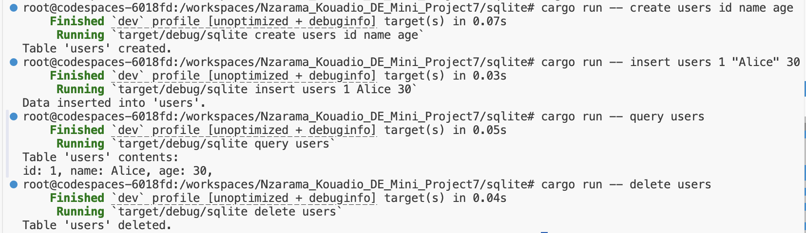

## Mini Project 7: Rust CLI Project: Database Operations with Simple CRUD

This project demonstrates how to perform basic CRUD (Create, Read, Update, Delete) operations using a Command Line Interface (CLI) built with Rust. The CLI simulates database-like operations, which allows to create tables, insert data, query the contents, and delete tables.

# Project Overview
The CLI supports the following operations:

- **Create**: Create a table with specified columns.

- **Insert**: Insert rows of data into a specified table.

- **Query**: Display the contents of a table.

- **Delete**: Remove a table from the database.

The project uses JSON to store table data, allowing persistence between runs. Data is saved in the db.json file.

# Set Up Instructions

You can interact with the project either by running it directly from source code using cargo or by using the provided binary executable. Follow the instructions below for each method.

> 1. Running from Source

- Install Rust on your machine

- Clone the repository: git clone https://github.com/nogibjj/Nzarama_Kouadio_DE_Mini_Project7.git

- Navigate to the project directory: cd sqlite

- Run the following to build and run the project: `cargo build` and `cargo run -- <command>`

> 2. Using the Binary Executable

- To build the binary, navigate to the project root and run `cargo build --release`

- Navigate to target/release

- Run the binary: `./sqlite <command> <options>`

# Important File Elements

- `main.rs`: The main Rust file containing the CLI logic and CRUD operations.

- `db.json`: The file where table data is stored.

- `Cargo.toml`: Rust package file with dependencies.

# Explanation of JSON Database

The CLI tool uses a simple JSON file (db.json) to store all table data. Each table consists of a set of columns and rows. The database is saved after each operation to ensure persistence between program executions.

# Command and Usage in Source Code

> Create Table

`cargo run -- create <tablename> <column1> <column2> ...`

> Insert Data into Table

`cargo run -- insert <table_name> <value1> <value2> ... <valueN>` 

> Query Table

` cargo run -- query <table_name> `

> Delete Table

`cargo run -- delete <table_name>`

> Example: This creates a table called users with columns id, name, and age. This inserts a row into the users table with the values 1, "Alice", and 30. This displays all rows of the users table. This will delete the users table from the database

cargo run -- create users id name age

cargo run -- insert users 1 "Alice" 30

cargo run -- query users

cargo run -- delete users

# Command and Usage in Binary

> Create Table

`./sqlite create <tablename> <column1> <column2> ...`

> Insert Data into Table

`./sqlite insert <tablename> <value1> <value2> ...`

> Query Table

`./sqlite query <tablename>`

> Delete Table

`./sqlite delete <tablename>`

> Example: Reproducing the same example as before

